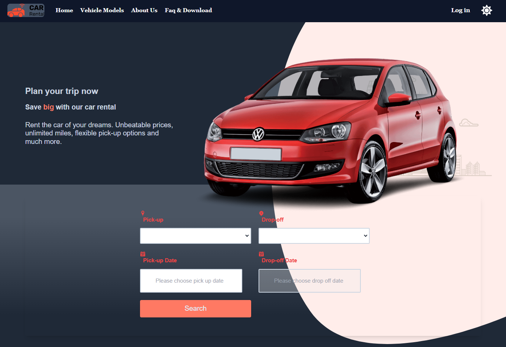
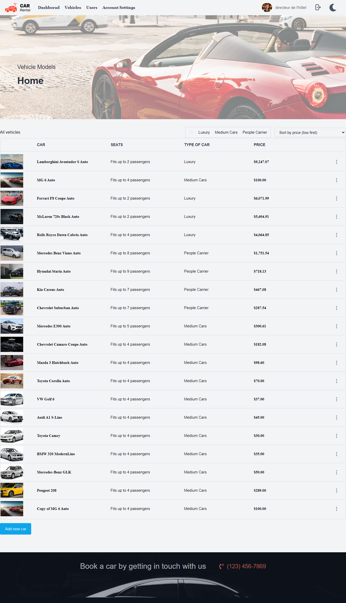
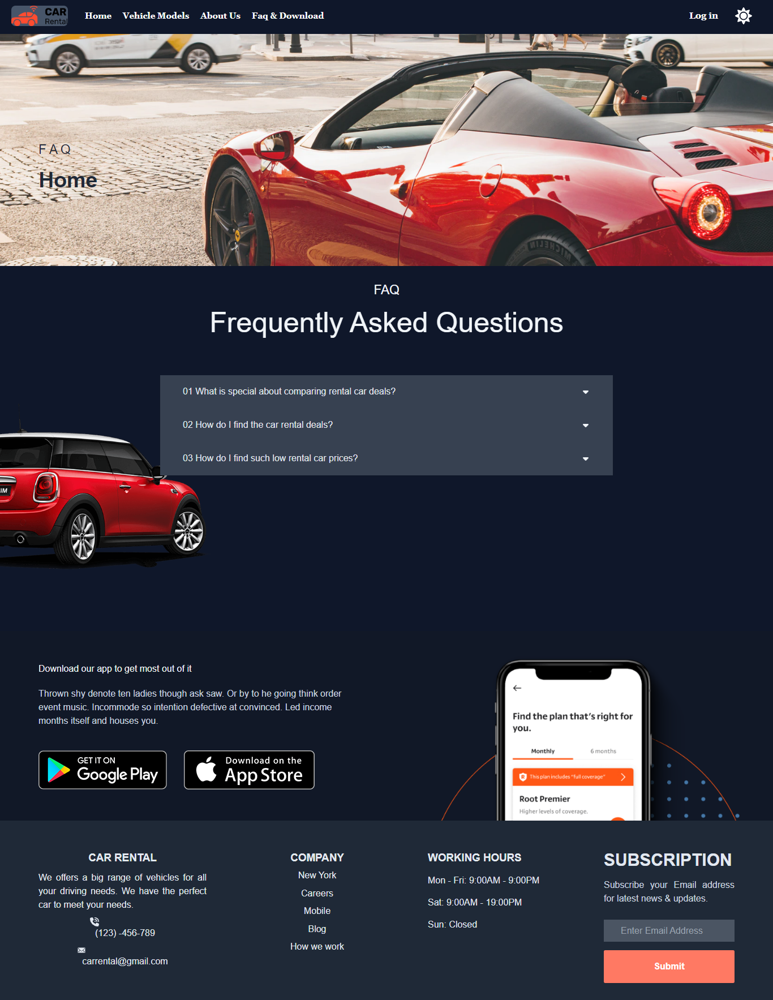

<h2>About the project</h2>

  
The <b> Voyager </b> website is an online platform that allows users to rent cars for personal or business use. The website provides an easy-to-use interface for searching, comparing, and reserving cars from a wide selection of vehicles that vary in make, model, size, and price.

<h2> Phase 1 : Static</h2>

Completely Static Website

<h3>Created with:</h3>

» HTML / Css  
» React JS

<h4> Libraries: </h4>

» react-router-dom  
» @tabler/icons-react

<h2> Phase 2 : Half Dynamic</h2>

Half Dynamic Website ( No external database )

<h4> Libraries: </h4>

» react-router-dom version(6) 
» react-hook-form 
» styled-components 
» react-toastify 
» react-icons 
» react-datepicker 
» react-canvas-confetti 

<h2> Phase 3 : Dynamic</h2>

Dynamic Website ( Supabase as external database )

<h4> Libraries: </h4>

» All the libraries used in Phase 2 + : 
» @supabase/supabase-js 

<h2> Phase 4 : Full Dynamic</h2>

Fully Dynamic Website ( Supabase as external database ) + management Panel

<h4> Libraries: </h4>

» All the libraries used in Phase 3 + : 
» date-fns 
» react-select-country-list 

<h2> Phase 5 : TypeScript version</h2>

Fully Dynamic Website ( Supabase as external database ) + 
management Panel (create, update and delete cars, users, bookings, ...) 
equipped with TypeScript

<h4> Libraries: </h4>

» All the libraries used in Phase 4 + : 
» As for Styling, I have used Tailwindcss  

<h2> Phase 6 : Next.js version</h2>
Coming soon... 😉

<h2>Screenshots of the Project 📸</h2>
 

